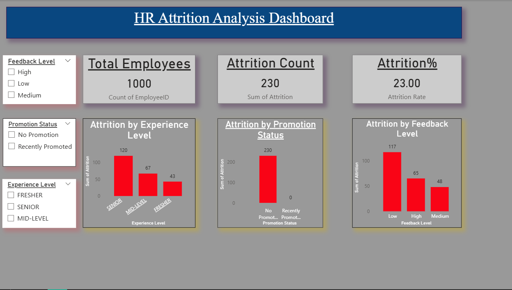

# HR Attrition Analysis Dashboard

HR Attrition Analysis Dashboard 📊

📌 Project Overview

This project analyzes employee attrition using Power BI to identify key factors affecting employee turnover.
It helps HR teams make data-driven decisions to reduce attrition and improve employee retention.

📊 Dashboard Features

- Total Employees, Attrition Count, Attrition %
- Attrition by Experience Level
- Attrition by Promotion Status
- Attrition by Feedback Level
- Interactive filters

🔍 Key Insights

- Attrition rate is 23%
- Higher attrition observed in low experience employees
- Employees without promotion have higher attrition
- Low feedback leads to higher attrition

🛠 Tools & Skills Used

- Power BI
- Data Cleaning
- Data Visualization
- DAX (Data Analysis Expressions)
- Business Analysis

📸 Dashboard Preview

"Dashboard" (dashboard.png)

📂 Files

- HR Report.pbix
- dashboard.png
